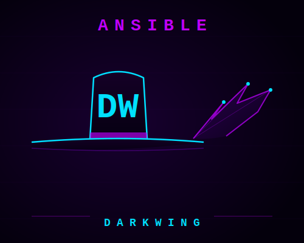
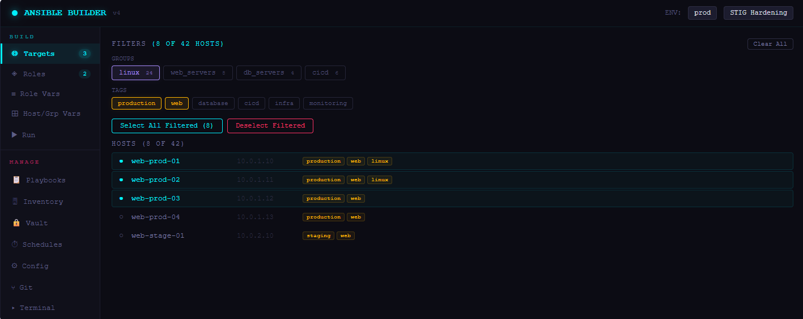
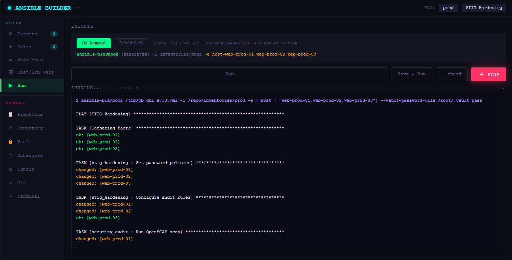
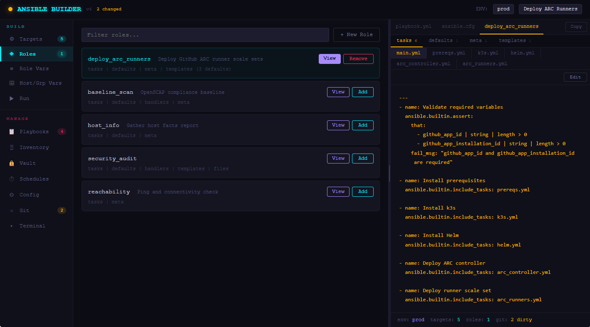
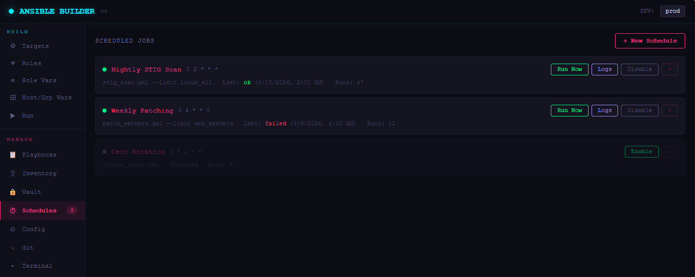
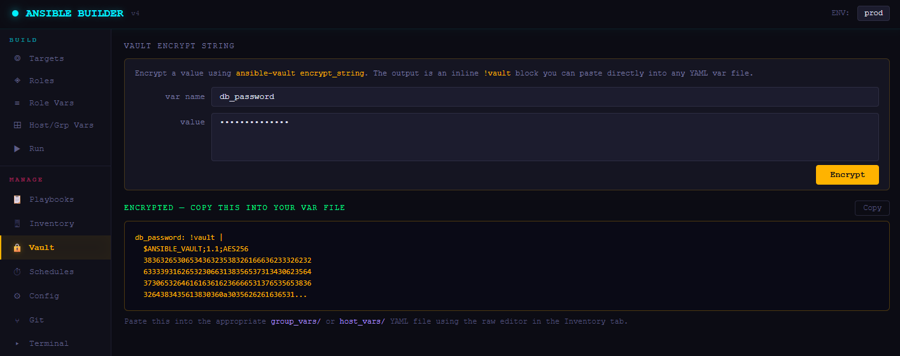

<p align="center">
  
</p>

# ansible-darkwing
[](LICENSE)

A general-purpose Ansible automation framework with responsive web GUI.  Templates include assessment roles, hardening roles, user provisioning, and flexible deployment. Designed to work against mixed Linux environments (Ubuntu, Debian, AlmaLinux/RHEL, Oracle, CentOS, Kali).

---

## What's in the box

| Component | Description |
|-----------|-------------|
| [roles/](roles/) | Reusable roles for assessment, auditing, and provisioning |
| [playbooks/](playbooks/) | Ready-to-run and template playbooks |
| [webgui/](webgui/) | FastAPI + React browser UI for managing playbooks and inventory |
| [inventories/](inventories/) | Inventory structure with group_vars and host_vars |
| [collections/](collections/) | Ansible collection dependencies |

---

## [→ Getting Started Guide](GETTING-STARTED.md)

---

## Prerequisites

**Control node:**
- Ansible Core 2.14+
- Python 3.10+
- `ansible.posix` and `community.general` collections (see [Collections](#collections))
- SSH access to your target hosts (key-based recommended)
- `ansible-vault` if using encrypted vars

**Target hosts:**
- Python 3 (Ansible will auto-detect)
- A dedicated service account with sudo (or passwordless sudo for automated runs)

---

## Quick Start

### 1. Clone and install collections

```bash
git clone <your-repo-url> ansible-darkwing
cd ansible-darkwing
ansible-galaxy collection install -r collections/requirements.yml
```

### 2. Configure `ansible.cfg`

Copy and edit the config — at minimum set your SSH key and remote user:

```bash
cp ansible.cfg ansible.cfg.bak   # keep a backup
$EDITOR ansible.cfg
```

Key values to set:

```ini
remote_user = your_ansible_service_account
private_key_file = /path/to/your/ssh/key
vault_password_file = /path/to/.vault_pass   # only if using vault
```

### 3. Build your inventory

Copy the included example inventory and populate it with your real hosts:

```bash
cp -r inventories/example inventories/prod
```

Edit `inventories/prod/hosts.yml` to match your environment. The key functional groups to add:

```yaml
all:
  children:
    linux:      # all Linux hosts — most roles target this group
    ubuntu:
    debian:
    rhel:
```

Set common variables in `inventories/prod/group_vars/all/main.yml`.

### 4. Verify connectivity

```bash
ansible -m ping all
```

### 5. Build and run a playbook

```bash
# Start from the annotated template
cp playbooks/playbook_template.yml playbooks/my-scan.yml

# Run it
ansible-playbook playbooks/my-scan.yml
```

---

## Directory Structure

```
ansible-darkwing/
├── ansible.cfg                   ← Ansible settings (forks, SSH, vault)
├── collections/
│   └── requirements.yml          ← Collection dependencies
├── inventories/
│   └── example/                  ← Copy this to create your environment (e.g. prod/)
│       ├── hosts.yml
│       ├── group_vars/all/
│       └── host_vars/
├── playbooks/
│   └── playbook_template.yml     ← Annotated starting point for new playbooks
├── roles/
│   └── role_template/            ← Annotated starting point for new roles
├── scripts/
│   └── validate_inventory.sh     ← Sanity-check hosts.yml syntax
└── webgui/                       ← Optional browser UI
    ├── README.md                 ← Web GUI setup and deployment guide
    └── docs/                     ← Extended documentation
```

---

## Ansible Configuration

`ansible.cfg` is pre-configured with sensible defaults. Things you **must** change for your environment:

| Setting | Default | What to set |
|---------|---------|-------------|
| `remote_user` | `ansible` | Your service account username |
| `private_key_file` | *(commented out)* | Path to your SSH private key |
| `vault_password_file` | *(commented out)* | Path to your vault password file |
| `inventory` | `inventories/prod/hosts.yml` | Adjust if you rename your env |

SSH multiplexing is enabled by default (`ControlMaster`) — this significantly speeds up runs against many hosts.

---

## Inventory Setup

### Guardrails

`group_vars/all/main.yml` includes a guardrails system that prevents accidental enforcement changes. By default, all protections are **on**:

```yaml
do_not_touch:
  ssh: true
  pam: true
  firewall: true
  sudoers: true
  crypto: true
  auditd: true
```

To allow enforcement on a specific host, set `enrolled: true` in its `host_vars/` file and disable only the specific guardrails you need.

### Vault

Sensitive values (passwords, tokens, keys) go in `group_vars/all/vault.yml` (or per-group/host vault files), encrypted with `ansible-vault`:

```bash
ansible-vault create inventories/prod/group_vars/all/vault.yml
ansible-vault edit inventories/prod/group_vars/all/vault.yml
```

---

## Playbooks

| Playbook | Description |
|----------|-------------|
| `playbook_template.yml` | Annotated skeleton — copy this to start a new playbook |

All playbooks accept `--limit group_or_host` and `-e target=mygroup` to scope the run.

---

## Roles

The skeleton ships with [roles/role_template/](roles/role_template/) — a fully annotated starting point. Your own roles live alongside it and are gitignored by default, keeping your inventory private.

### Creating a New Role

```bash
cp -r roles/role_template roles/your_new_role
```

Every file in `role_template` has inline comments explaining purpose and best practices.

### Example Role Patterns

Here are examples of what you might build using this framework:

#### Assessment Roles (read-only, no `become` side effects)

| Role | What it does |
|------|-------------|
| `01_reachability` | Tests ICMP, SSH port, and Ansible connectivity; generates a per-host report |
| `02_connection_sudo` | Validates SSH auth and become/sudo access; reports failures with remediation hints |
| `03_host_info` | Collects OS, network, ports, disk usage, and SSH-capable users across mixed OS |
| `04_security_audit` | Runs a CIS-aligned security audit script; produces a scored report with remediation priorities |
| `05_Get-SSH-Users` | Extracts sudo users and SSH auth configuration; saves per-host output files |

#### Provisioning Roles (enforce changes, respect `do_not_touch` guardrails)

| Role | What it does |
|------|-------------|
| `user_provision` | Creates users, installs SSH keys, configures passwordless sudo; fully variable-driven |

---

## Collections

Install dependencies:

```bash
ansible-galaxy collection install -r collections/requirements.yml
```

Required collections:

| Collection | Used for |
|------------|---------|
| `ansible.posix` | `authorized_key`, `sysctl`, `firewalld` modules |
| `community.general` | `ufw`, `ini_file`, various utility modules |

---

## Web GUI (Optional)

The `webgui/` directory contains a FastAPI + React app that wraps the CLI. It reads and writes your actual files — no separate data store.

<!-- Screenshots -->
<p align="center">
  
</p>
<p align="center">
  
</p>
<p align="center">
  
</p>
<p align="center">
  
</p>
<p align="center">
  
</p>

**[→ Web GUI Setup Guide](webgui/README.md)**

Extended documentation:

| Doc | Contents |
|-----|----------|
| [User Guide](webgui/docs/USER-GUIDE.md) | Day-to-day usage: building plays, running playbooks, managing inventory |
| [Admin Guide](webgui/docs/ADMIN-GUIDE.md) | Docker deployment, SAML/Entra ID auth, TLS with Caddy |
| [API Reference](webgui/docs/API-REFERENCE.md) | All API endpoints with request/response examples |
| [Scheduling](webgui/docs/SCHEDULING.md) | Cron-style automated playbook runs |
| [Troubleshooting](webgui/docs/TROUBLESHOOTING.md) | Common errors and fixes |

Quick start (no auth, local dev):

```bash
cd webgui
docker compose -f docker-compose.simple.yml up -d
# open http://localhost:8420
```

---

## Scripts

```bash
# Validate hosts.yml syntax (runs ansible-inventory --list)
bash scripts/validate_inventory.sh
```

---

## Contributing / Extending

1. Use `role_template` as the skeleton for any new role
2. Use `playbook_template.yml` as the skeleton for any new playbook
3. Assessment roles should always be read-only (no changes, no `become` side effects)
4. Enforcement roles must respect the `do_not_touch` guardrails
5. Store secrets in vault, never in plaintext vars files
